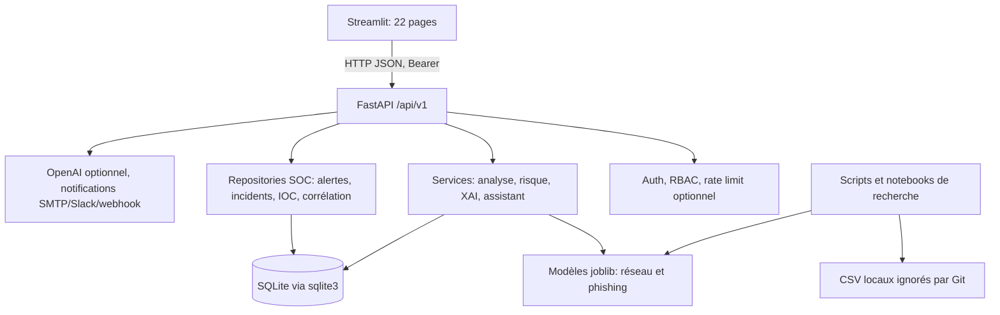
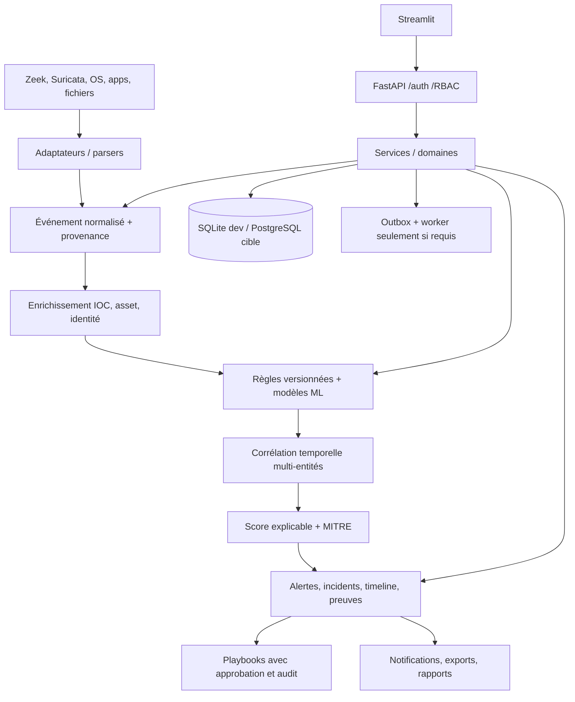

# Audit TogoCyber-IA

**Date :** 2026-10-06  
**Périmètre :** checkout local `TogoCyber-IA`, tous les répertoires applicatifs, configurations, contrats API, tests, scripts, documentation, données et notebooks présents. Cet audit est une revue statique, pas une certification de sécurité ni une validation de production.

> La mission d’audit a été reçue alors que six fichiers portaient déjà des changements locaux non commités issus du travail antérieur sur le rate limiting : `.env.example`, `backend/app/core/config.py`, `backend/app/core/rate_limit.py`, `docker-compose.yml`, `docs/deployment.md` et `tests/test_rate_limit.py`. Ils ont été conservés et inclus dans l’état examiné; leurs tests Python n’ont pas pu être exécutés.

## Synthèse exécutive

TogoCyber-IA est un **prototype local de détection et de triage SOC**, déjà plus substantiel qu’une maquette : API FastAPI versionnée, interface Streamlit, modèles supervisés entraînables, XAI, authentification, persistance SQLite et workflows d’alertes/incidents/IOC/corrélations. Le code et la documentation font généralement une distinction honnête entre intégration configurée et source réellement branchée; aucun jeu d’alertes ou de télémétrie fictive n’a été identifié dans les chemins applicatifs examinés.

Ce n’est toutefois **pas encore une plateforme SIEM/XDR** : un premier contrat d’événement et endpoint d’ingestion Suricata EVE ont été ajoutés, mais il s’agit d’une soumission HTTP manuelle, sans collecteur d’infrastructure. Aucun moteur de détection sur ces événements, mapping MITRE, enrichissement IOC automatique ou réponse n’est branché. Le moteur de corrélation existant travaille encore sur le nombre d’alertes par module et sévérité dans une fenêtre temporelle.

**Risque prioritaire à traiter avant tout build distribué :** `.dockerignore` exclut déjà correctement `.env`, les corpus bruts (sauf README), les annotations (sauf gabarit), les bases SQLite et artefacts ML. Il n’excluait toutefois pas `.git` ni `reports/`, alors que les Dockerfiles copient tout le contexte. L’historique Git peut grossir l’image ou contenir des informations versionnées antérieurement; les rapports locaux peuvent contenir des résultats/données dérivées. Ces deux exclusions ont été ajoutées après l’audit.

## Méthode et limites de validation

La revue a couvert les points d’entrée et routes API, services/repositories/schémas backend, vues et client API frontend, modules ML et notebooks, scripts, schémas SQL, dépendances, Docker/Compose/CI, documents et README de données. Les recherches statiques ont également examiné les décorateurs de routes, les boutons/forms Streamlit, les appels API et les marqueurs `TODO`/`FIXME`/`mock`/`fake`.

Le dépôt contient 23 fichiers de tests `unittest` exécutables par pytest; les workflows CI configurent Ruff, pytest, Bandit, pip-audit informatif et un build Docker. Les notebooks 01–07 existent, mais **aucune cellule n’a été exécutée** dans ce checkout.

Python 3.11.9 a été installé en mode utilisateur et les dépendances de développement du dépôt ont été installées dans `.venv`. L’installation initiale a révélé que `TestClient` de Starlette demandait `httpx2`, absent du manifeste; `requirements-dev.txt` le déclare désormais. Un scan initial a également détecté des versions bootstrap anciennes de pip/setuptools et pytest; pip/setuptools ont été mis à jour dans le venv et pytest est maintenant borné à `>=9.0.3,<10`.

**Validation exécutée après les correctifs :** 145 tests pytest distincts passent sous Python 3.11.9 / pytest 9.1.1 (exécutés en quatre groupes pour contourner la capture incomplète des longues sorties terminal), avec 20 sous-cas; Ruff, Bandit, pip-audit, `docker compose config --quiet`, `git diff --check` et les diagnostics éditeur passent. Les avertissements pytest restants sont des dépréciations de dépendances SHAP/FastAPI.

Le daemon Docker est indisponible : pas de build ni inspection des couches d’image, ni de lancement API/Streamlit. Aucun test navigateur/E2E n’a été exécuté. Les notebooks restent non exécutés et les métriques d’entraînement ne sont pas reproductibles sans les données locales ignorées par Git. Les constats comportementaux s’appuient sur le code et les tests, pas sur une campagne runtime des intégrations externes.

## Architecture actuelle

- **Frontend :** Streamlit, pages sous `frontend/views`, client HTTP partagé sous `frontend/services/api_client.py`; les permissions visibles dans la navigation sont complétées par des contrôles de rôles côté API.
- **Backend :** FastAPI, 19 modules de routes sous `/api/v1`, schémas Pydantic, services métier et repositories SQLite séparés. La séparation API/service/repository est déjà présente, même si chaque repository gère ses connexions SQLite directement.
- **ML :** pipelines d’entraînement et inférence séparés pour le réseau et le phishing; fonctions XAI SHAP et LIME. Les artefacts sont chargés depuis des fichiers joblib.
- **Données :** SQLite locale; schéma maintenu à la fois dans `database/schema.sql` et dans `backend/app/models/database_models.py`. Migrations manuelles additives, sans Alembic.
- **Exécution :** les deux services Compose réutilisent la même image Python contenant tout `requirements.txt`; aucun worker, broker ou PostgreSQL n’est présent. Les probes sont `/api/v1/health`, `/api/v1/health/live` et `/api/v1/health/ready`.

## Fonctionnalités réellement implémentées

| Domaine | Fonction observée | Limite de portée |
| --- | --- | --- |
| Authentification | Inscription en rôle `User`, connexion, jeton HMAC/JWT de 30 minutes, révocation, administration des comptes et verrouillage par échecs | Trois rôles (`Admin`, `Analyst`, `User`); pas de refresh token, MFA/TOTP ou matrice de permissions fines |
| Analyse réseau | Validation du contrat à neuf caractéristiques, inférence modèle, score, recommandations, explication SHAP et enregistrement de métadonnées | Analyse unitaire soumise par un utilisateur; aucun collecteur réseau/PCAP/NetFlow |
| Phishing | Classification de texte, score, LIME borné, création d’alerte/incident selon la sévérité | Modèles entraînés sur courriels anglais de démonstration; pas de validation sur SMS ou données togolaises |
| URL | Analyse locale de structure (hôte, schéma, punycode, IP littérale, raccourcisseur, motifs) | Heuristique seulement : pas de DNS, réputation, redirections ou modèle URL; score non calibré |
| Alertes/incidents | Création à partir des analyses, transitions d’état, assignation, commentaires/tags, historique et timeline | Modèle limité aux analyses réseau/phishing; pas de preuves, actifs, utilisateurs affectés ou événements bruts |
| Corrélation | Règles configurables module/sévérité/seuil/fenêtre et résultats liés aux alertes existantes | Comptage temporel simple; pas de corrélation par IP, utilisateur, machine, IOC, session ou technique MITRE; ne crée pas d’incident |
| IOC | CRUD, validation de types, tags, recherche dans le registre local | Pas d’alimentation externe ni de rapprochement automatique avec les analyses |
| Playbooks | CRUD de procédures ordonnées et affichage d’étapes | Guides documentaires uniquement; aucune exécution ni action de réponse |
| Notifications | Outbox à partir d’alertes réelles et tentative d’envoi SMTP, Slack ou webhook | Déclenchement manuel/synchrone; premier canal configuré seulement; pas de worker/retry distribué |
| Supervision ML | Agrégats sur analyses et retours d’analystes; suivi limité de taux et versions | Pas de suivi du drift des caractéristiques brutes, qui ne sont volontairement pas conservées |
| Exports et audit | Exports CSV, rapport d’analyse JSON côté frontend, journal SQL append-only | Pas de rapports PDF ni de journal de sécurité complet/tamper-evident |
| Assistant | Appel HTTPS OpenAI facultatif avec prompt défensif et erreurs explicites | Pas de contexte incident/IOC structuré, ni de sortie contractualisée `FACT/INFERENCE/RECOMMENDATION` |
| Ingestion événementielle | Contrat `NormalizedEvent`, normalisation Suricata EVE, dépôt SQLite idempotent, recherche SOC paginée | Soumission HTTP unitaire seulement; pas de tailer/socket, enrichissement, règles événementielles, alertes ou MITRE |

### API existante

Les décorateurs recensés exposent désormais 70 opérations dans 19 modules : santé; auth et utilisateurs; analyses réseau/phishing/URL; assistant; ingestion/liste d’événements; historique; alertes; incidents; recherche et timeline; IOC; règles/résultats de corrélation; retours/supervision ML; notifications; playbooks; intégrations; audit et exports.

Les routes ont une implémentation dans les modules correspondants et plusieurs sont consommées par `frontend/services/api_client.py`. L’absence de test d’exécution dans cet audit ne permet pas de confirmer leur état runtime. Routes de détail exposées sans appel frontend identifié : `GET /api/v1/auth/users/{user_id}`, `GET /api/v1/correlation/rules/{rule_id}` et `GET /api/v1/correlation/findings/{finding_id}`. Elles restent disponibles aux clients API externes; ce n’est pas en soi un défaut.

`/api/v1/events/ingest/suricata` et `/api/v1/events` existent; aucun endpoint `/assets`, `/threat-intel/feeds` ou `/metrics` n’a été trouvé. Les modules d’intégration Zeek/Suricata/Syslog/VirusTotal/AbuseIPDB/SIEM retournent un **état de configuration** basé sur la présence de variables d’environnement; ils ne collectent ni ne vérifient la connectivité des sources.

## Données simulées, boutons et contenu de démonstration

- Aucun jeu d’alertes, d’incidents, d’IOC ou de statistiques fictives n’a été trouvé dans le code applicatif parcouru. `scripts/seed_database.py` initialise le schéma sans insérer d’historique synthétique.
- Les statistiques SOC interrogent les tables SQLite réelles. L’accueil calcule ses résumés à partir de l’historique réellement enregistré; le texte précise qu’il ne s’agit pas de volumes globaux/journaliers.
- Les mesures ML dans `docs/demo_results.md` sont présentées comme des résultats historiques mesurés sur des jeux publics, avec limites de domaine. Les fichiers CSV, artefacts et registre ne sont pas présents dans le checkout audité; ces chiffres ne sont donc pas reproductibles ici sans téléchargement et réentraînement.
- Les indicateurs d’intégration « configuré » signifient présence des variables requises, pas connectivité ou collecte effective. Les pages le signalent explicitement.
- Le relevé statique des boutons et formulaires n’a pas identifié de bouton d’action manifestement sans callback/API. Les boutons d’analyse, gestion SOC, navigation, comptes, notifications et playbooks invoquent des actions. L’export est relié mais son téléchargement est déclenché trop tôt (constat F-04 ci-dessous).
- Les 7 notebooks sont des workflows de recherche qui consomment les CSV locaux; tous sont non exécutés dans le checkout.

## Constats priorisés

### F-01 — Le contexte Docker incluait l’historique Git et les rapports (moyen, corrigé)

`.dockerignore` excluait déjà `.env`, les environnements Python et caches, les corpus bruts sauf README, les annotations sauf gabarit, les bases SQLite et artefacts joblib/registre. Les deux Dockerfiles exécutent `COPY . .`; `.gitignore` n’est pas appliqué au contexte Docker. `.git/` et `reports/` n’étaient pas ignorés et pouvaient donc être incorporés dans l’image. `.dockerignore` les exclut désormais. Le build réel et l’inspection des couches restent à faire lorsque le daemon Docker sera disponible.

**Action restante :** inspecter l’image et ses couches sur un build propre avant publication; ne pas se contenter d’un volume runtime en lecture seule.

### F-02 — Mise à jour de compte non atomique (moyen, corrigé)

`update_managed_user()` pouvait changer le rôle via une transaction repository, puis traiter `is_active`. Pour une demande combinée qui change le rôle et tente ensuite une désactivation interdite (par exemple auto-désactivation), la seconde opération levait une erreur après le commit du rôle. Le test ajouté reproduisait un HTTP 409 alors que le rôle était déjà passé à Analyst. Le service valide maintenant l’état final avant toute écriture et le repository applique rôle, activation et révocation de sessions dans une transaction `BEGIN IMMEDIATE`; la contrainte du dernier administrateur est vérifiée sous le même verrou.

**Vérification :** test de non-régression ajouté et passé; tout le fichier auth passe (15 tests).

### F-03 — Rechargement des modèles à chaque prédiction et explication (moyen, corrigé)

`load_model()` exécutait `joblib.load()` à chaque appel. Les services appellent successivement le prédicteur puis l’explicateur, qui chargeaient chacun le même artefact; le chemin réseau et phishing désérialisait donc deux fois le modèle par requête. Le loader dispose maintenant d’un cache LRU borné à huit entrées, indexé par chemin absolu, `mtime_ns` et taille; un artefact remplacé invalide sa version précédente dès l’appel suivant.

**Vérification :** test de réutilisation/invalidation ajouté; contrats ML et tests d’inférence réseau/phishing passent. La readiness au démarrage et les mesures de latence restent à faire.

### F-04 — Les exports étaient téléchargés au rendu de la page (moyen, corrigé)

`render_export_button()` appelait `download_export()` immédiatement avant de construire le `st.download_button`. Streamlit relance les vues à chaque interaction; les exports étaient donc demandés même sans clic, ce qui multipliait les requêtes et transferts de données. Le composant affiche maintenant une action de préparation; l’appel API n’a lieu qu’après le clic, puis un bouton de téléchargement est proposé.

**Vérification :** tests ajoutés pour l’absence de requête avant clic et la préparation/téléchargement après clic; les deux passent. Pas de test navigateur manuel dans cet environnement.

### F-05 — Verrouillage par adresse uniquement (moyen, proxy harmonisé)

`/auth/login` utilise maintenant la même clé de client proxy-aware que le middleware, avec `X-Forwarded-For` ignoré sauf si le pair immédiat appartient à `TRUSTED_PROXY_CIDRS`. Le risque de budget partagé derrière un proxy configuré est donc corrigé. La limitation reste néanmoins uniquement par client : des tentatives réparties sur plusieurs adresses peuvent viser un même compte, tandis que des utilisateurs derrière un proxy non déclaré partagent le pair direct. Le rate limiter HTTP général reste désactivé par défaut (`RATE_LIMIT_PER_MINUTE=0`); le verrouillage login a son propre seuil de cinq échecs par client et fenêtre de 15 minutes.

**Action restante :** compléter la protection par une politique au niveau compte qui résiste au credential stuffing sans permettre un déni de service trivial, et externaliser l’état si l’application devient multi-instance. Tests proxy et spoofing ajoutés et passés.

### F-06 — Configuration d’intégrations incomplète dans Compose (moyen, partiellement corrigé)

`docker-compose.yml` transmet maintenant au conteneur les variables VirusTotal, AbuseIPDB, SIEM, Zeek, Suricata, Syslog, SMTP, Slack et webhook; `.env.example` documente aussi les paramètres SMTP nécessaires. Le statut SMTP ne passe à `configured` que si hôte, expéditeur et destinataire sont tous présents. Le contrôle de configuration Compose confirme que les noms de variables sont transmis. Cette correction ne transforme pas les adaptateurs Zeek/Suricata/Syslog/VT/AbuseIPDB/SIEM en collecteurs ou connecteurs fonctionnels; ils demeurent déclaratifs comme décrit dans les limites.

**Action restante :** vérifier le statut et l’envoi depuis le conteneur avec le daemon actif; définir les volumes/permissions de lecture si une vraie collecte Zeek/Suricata est implémentée.

### F-07 — Santé modèle basée sur l’existence du fichier (moyen, corrigé en partie)

`/api/v1/health` vérifie maintenant que l’artefact et son registre sont effectivement chargeables; une erreur laisse l’API vivante mais marque le modèle indisponible. L’absence d’artefact (mode démo non entraîné) est une indisponibilité attendue sans traceback; un fichier présent mais invalide reste logué. `/api/v1/health/live` fournit une sonde sans dépendance, et `/api/v1/health/ready` retourne 503 si SQLite est indisponible tout en rapportant les capacités modèle séparément. Le chargement est paresseux au premier healthcheck/analyse et profite du cache, pas préchauffé explicitement dans le lifespan.

**Action restante :** décider si les modèles doivent être préchauffés dans le lifespan du déploiement; conserver la règle de ne charger que des artefacts joblib de provenance fiable.

### F-08 — Journal d’audit incomplet pour l’exploitation (moyen, partiellement corrigé)

Le journal SQLite couvre plusieurs actions sensibles et bloque UPDATE/DELETE par triggers. Les routes d’ajout de commentaires/tags sur alertes et d’ajout/retrait de tags IOC enregistrent maintenant l’acteur, l’action et l’ID de la ressource sans recopier le contenu du commentaire/tag. Les tentatives de diffusion de notifications sont également journalisées, avec un résultat agrégé sans secret ni payload. Les contraintes sont étendues dans le schéma exécuté et dans `database/schema.sql`; la migration additive existante reconstruit la table et conserve les lignes antérieures. Restent absents l’adresse cliente, le user-agent, un correlation ID et plusieurs résultats d’échec. Les triggers protègent contre les modifications via le chemin applicatif ordinaire, pas contre l’administrateur du fichier SQLite qui peut modifier la base ou ses triggers.

**Action restante :** couvrir l’exécution des notifications et les échecs pertinents, ajouter une identité de requête et exporter les logs vers un stockage append-only distant avant de revendiquer une résistance à l’altération. Test de migration sur base préexistante passé sans perte de lignes.

### F-09 — Documentation de limites contradictoire (moyen, corrigé)

`docs/limitations.md` affirmait l’absence d’authentification API et d’analyse d’URL alors que les deux sont implémentées. `docs/deployment.md` décrivait également des endpoints sans authentification, ce qui ne décrivait pas les routes d’analyse/SOC actuelles. Ces paragraphes ont été corrigés : ils distinguent désormais les routes publiques, l’authentification métier et la limite heuristique de l’analyse URL.

**Vérification :** documentation relue et `git diff --check` passe.

### F-10 — Persistance non portable et schéma à double source (moyen)

SQLite via `sqlite3` est l’unique moteur; les URLs PostgreSQL sont explicitement rejetées. Les migrations sont additives/manuelles, et le schéma est dupliqué dans `database/schema.sql` et `SCHEMA_SQL`. La conservation purge l’historique et certains artefacts, mais pas les alertes/incidents/audits, comme le documente la base; une politique opérationnelle demeure nécessaire.

**Action :** garder SQLite pour le MVP local, instaurer des migrations versionnées et tests de migration; introduire l’adaptateur PostgreSQL seulement avec exigences multi-utilisateur/transactionnelles et tests réels.

## Sécurité et qualité : points positifs et écarts

**Contrôles présents :** hachage PBKDF2-HMAC-SHA256 salé; jetons HMAC à durée limitée dont le `jti` est stocké sous hash et vérifié en base; révocation au logout, désactivation et changement de mot de passe; contrôles backend par rôles; inscription publique limitée au rôle User; validation Pydantic; requêtes SQL paramétrées dans les repositories examinés; CORS par origines; limites de longueur d’entrée; absence de DNS/HTTP pour les URLs; historique sans texte ni caractéristiques brutes; gestion explicite des intégrations et erreurs non simulées.

**Écarts pour une exploitation professionnelle :** rôles actuels plus grossiers que ceux demandés; absence de MFA et refresh token; état de connexion/verrouillage et limites distribuées non adaptés au multi-processus; pas de TLS/headers de sécurité configurés dans l’application; taille maximale globale des requêtes à confier au proxy; absence d’observabilité structurée par requête, correlation ID, `/metrics` et readiness dédiée; logs/audit non externalisés.

Les dépendances principales du manifeste correspondent aux imports de l’application, des modèles ou de la recherche/notebooks; aucun paquet inutilisé n’a été confirmé par la revue statique. Les versions runtime restent non épinglées, et `pip-audit` est informatif/non bloquant dans la CI : le risque de dérive de versions et de vulnérabilités transitives reste à traiter par stratégie de lock/update et suivi des rapports.

## Fonctionnalités manquantes par rapport à l’objectif

1. **Collecte et normalisation :** un premier `NormalizedEvent` et adaptateur Suricata EVE par POST manuel existent, avec `event_id`, source/type, `raw_event`, validation, déduplication, persistence et lecture SOC. Aucun fichier/socket n’est collecté automatiquement; pas encore d’adaptateur Zeek/Syslog/Sysmon, d’asset/identité normalisés ni de parsing d’autres sources.
2. **Détection :** pas de règles conditionnelles configurables sur les événements ni de détection brute-force/scan/beaconing/DNS tunneling/etc. Les règles présentes sont des seuils de comptage d’alertes existantes.
3. **MITRE ATT&CK :** aucun modèle/attribut technique, tactic, sub-technique ni catalogue d’attaque trouvé dans l’application.
4. **Corrélation/cas :** pas de clés par IP, utilisateur, hôte, session, IOC ou MITRE; un finding n’est pas converti en incident; timeline limitée aux métadonnées, transitions et commentaires existants.
5. **Threat intelligence :** base IOC saisie par analyste, sans feed ni enrichissement externe et sans jointure automatique avec les détections.
6. **Risk scoring :** risque principal = probabilité positive du classifieur mise à l’échelle; il n’agrège ni criticité d’actif, réputation, corrélation, risque utilisateur ou historique. Le score URL séparé est heuristique.
7. **Frontend SOC :** dashboard réel mais réduit à quelques compteurs/tableaux; pas de vues E/sec, MTTD/MTTR, actifs/utilisateurs, top IOC/IP/domaines, MITRE, hunt avancé ou timeline événements.
8. **Réponse/rapports :** playbooks non exécutables; pas de workflow d’approbation/containment; exports CSV et rapport JSON, pas de PDF ni rapports SOC périodiques.
9. **Infrastructure :** pas de PostgreSQL/Alembic, Redis/worker, HA, secrets manager, métriques Prometheus ou déploiement production. Ne pas ajouter ces dépendances avant un besoin et une architecture/test d’exploitation définis.

## Architecture cible

Conserver Streamlit comme interface MVP et FastAPI comme API versionnée, mais formaliser les contrats/domaines. Les adaptateurs de collecte doivent produire un événement commun validé avant enrichissement; les moteurs de règles/ML doivent consommer le même contrat. Les alertes, corrélations et incidents deviennent des entités liées, avec provenance et timeline auditable. Les connecteurs restent explicitement `not_configured`/`unavailable` tant qu’ils ne font pas de vraie collecte.

Les frontières à introduire progressivement : `api` (transport/validation), `core/security` (identité/permissions), `services` ou use-cases (orchestration), `engines` (détection/corrélation/risque), adaptateurs d’intégration/ingestion, repositories/transaction unit-of-work, modèles/schémas domaine, `workers` uniquement pour tâches lentes/retry. Un système de permissions explicites doit être vérifié côté backend; masquer une page ne constitue jamais une autorisation.

Pour la cible de persistance, privilégier un contrat repository testé, SQLite pour le développement et PostgreSQL avec SQLAlchemy/Alembic lorsque la migration devient une exigence opérationnelle. Introduire Redis/Celery/RQ seulement après un besoin de file durable, débit ou exécution différée mesuré; ne pas en faire une dépendance décorative.

## Roadmap de migration

| Phase | Livrable vérifiable | Porte de sortie |
| --- | --- | --- |
| 0. Audit | Ce document, état des risques et cible | Constats priorisés acceptés; aucune réécriture préalable |
| 1. Fondations | Contrats d’événement, permissions/audit définis, config unique, migrations et tests de compatibilité | Tests unitaires + migration SQLite existante/ancienne |
| 2. Sécurité | Résolution proxy partagée, permissions granulaires, révocation de sessions, audit contextualisé | Tests négatifs auth/RBAC/rate-limit et revue de menace |
| 3. Ingestion | Contrat/normaliseur et endpoint Suricata EVE manuel livrés; reste à ajouter le collecteur de fichier et les autres adaptateurs | Fixture représentative, validation, idempotence, provenance et ingestion réelle en daemon |
| 4. Détection/MITRE | Schéma de règles, première règle déterministe et mapping ATT&CK versionné | Tests de faux positifs/négatifs; règle désactivable |
| 5. Alertes/corrélation/incidents | Corrélation par clés et fenêtre; création de cas et timeline unifiée | Scénario événement→alerte→incident avec audit |
| 6. IOC/risque | Enrichissement local utile au pipeline, score borné et facteurs explicables | Tests de calcul/expiration; aucune réputation inventée |
| 7. ML/XAI | Cache/version de modèles, seuils et métriques adaptées au corpus | Mesures reproductibles, modèle absent/corrompu, limites affichées |
| 8. SOC UI/hunting | Vues basées sur API, filtres, drill-down et timeline | Vérification desktop/mobile et tests des workflows |
| 9. Réponse/intégrations | Outbox fiable, idempotence/retry, playbooks avec approbation | Actions réelles isolées, permissions et audit de bout en bout |
| 10. Exploitation | PostgreSQL/Alembic si requis, health/readiness, logs/metrics, sauvegarde et CI | Tests d’intégration/E2E, scan sécurité, build et procédures documentées |

Chaque phase doit être livrée séparément avec tests ciblés et migration compatible; ne pas prétendre qu’un connecteur, modèle ou action fonctionne tant qu’un test d’intégration ne l’a pas démontré.

## Vérifications prioritaires avant la phase 1

1. Vérifier par un build Docker et une inspection des couches que `.git/`, `reports/` et les autres fichiers locaux exclus ne sont pas copiés.
2. Installer/activer Python 3.11 et exécuter `python -m pytest`, `ruff check .`, Bandit et pip-audit; exécuter ensuite les tests Docker et les parcours UI.
3. Faire évoluer les événements normalisés vers la première règle de détection et le lien événement→alerte, avec décision MITRE explicite plutôt qu’une conversion implicite.
4. Actualiser les affirmations contradictoires dans les documents de limitations/déploiement.
5. Ajouter un collecteur surveillant un fichier EVE uniquement après avoir testé reprise/rotation, backpressure et permissions du fichier; ne pas ajouter d’autres sources avant d’avoir validé ce parcours.

## Correctifs appliqués après l’audit

- F-01 : exclusion de `.git/` et `reports/` dans `.dockerignore`; les exclusions de données personnelles/locales existaient déjà et ont été conservées.
- F-02 : validation des transitions de compte avant écriture et mise à jour atomique rôle/état/session dans le repository; test initial en échec avant correctif, puis passé.
- F-03 : cache LRU des artefacts chargé paresseusement et invalidé par signature du fichier; test couvrant absence de second `joblib.load()` et rechargement après modification.
- F-04 : l’export CSV est maintenant préparé à la demande; le composant ne transfère plus les données au simple rendu de la page.
- F-06 : Compose transmet les paramètres et secrets d’intégrations documentés; le statut SMTP requiert hôte/expéditeur/destinataire. Les collecteurs externes ne sont pas implémentés.
- F-07 : health vérifie le chargement réel modèle/registre et expose `/health/live` et `/health/ready`; readiness répond 503 si la base n’est pas disponible.
- F-08 : mutations des commentaires/tags d’alertes, tags IOC et tentatives de dispatch inscrites dans l’audit append-only; migration additive vérifiée sur base existante.
- Ingestion : premier vertical slice manuel Suricata EVE normalisé, dédoublonné et conservé dans SQLite avec filtres de lecture SOC, limites d’entrée, UTC et purge par heure d’ingestion; aucune détection/alerte automatique sur ces événements.
- F-09 : `docs/limitations.md`, `docs/security.md` et `docs/deployment.md` décrivent désormais l’authentification Bearer/RBAC et l’analyse URL locale tout en explicitant leurs limites.
- Dépendances de test : `requirements-dev.txt` déclare `httpx2`, requis par le TestClient des versions courantes de Starlette, et `pytest>=9.0.3,<10`, plancher qui évite l’avis de vulnérabilité observé.
- Rate limiting : le middleware et `/auth/login` partagent désormais la clé proxy-aware; les tests refusent le spoofing direct et valident le parcours d’un proxy approuvé. Le verrouillage par compte et l’état distribué restent à concevoir.
- Ingestion phase initiale : `NormalizedEvent`, normaliseur Suricata EVE, stockage/déduplication SQLite, endpoints SOC de dépôt et lecture, filtre/pagination et rétention bornée; aucune alerte ou corrélation n’est encore déclenchée par ces événements.

Cette première tranche réduit des défauts de sécurité/exploitation et rend l’environnement de test reproductible; elle **ne termine pas la phase 1 d’architecture cible**, ni les phases ingestion, détection, MITRE, enrichissement, corrélation multi-entités ou réponse.
